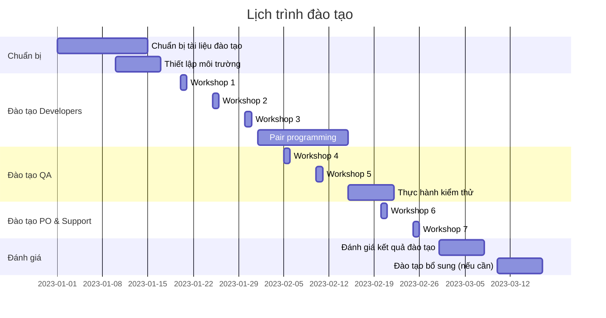

## Kế hoạch đào tạo và chuyển giao

### 1. Đối tượng đào tạo

| Nhóm | Mô tả | Nội dung đào tạo |
|------|-------|------------------|
| Developers | Các lập trình viên tham gia phát triển | Codebase mới, quy trình phát triển, công nghệ mới |
| QA Engineers | Nhân viên kiểm thử | Quy trình kiểm thử, test cases, công cụ kiểm thử |
| Product Owners | Người quản lý sản phẩm | Tính năng mới, cách sử dụng, lợi ích |
| Support Team | Nhân viên hỗ trợ khách hàng | Cách sử dụng, xử lý các vấn đề thường gặp |

### 2. Nội dung đào tạo

#### Cho Developers

1. **Kiến trúc tổng thể**
   - Cấu trúc thư mục
   - Luồng dữ liệu
   - Quản lý trạng thái
   - API integration

2. **Công nghệ mới**
   - Tailwind CSS (thay thế Material UI)
   - React Hooks và Context API
   - Testing với React Testing Library
   - Performance optimization

3. **Quy trình phát triển**
   - Git workflow
   - Code review process
   - CI/CD pipeline
   - Documentation

#### Cho QA Engineers

1. **Quy trình kiểm thử**
   - Unit testing
   - Integration testing
   - E2E testing
   - Visual regression testing

2. **Công cụ kiểm thử**
   - Jest và React Testing Library
   - Cypress
   - Chromatic/Percy
   - Lighthouse

3. **Test cases**
   - Critical paths
   - Edge cases
   - Performance testing
   - Accessibility testing

#### Cho Product Owners và Support Team

1. **Tính năng mới**
   - UI/UX mới
   - Các tính năng được cải thiện
   - Các tính năng mới

2. **Cách sử dụng**
   - Demo các luồng chính
   - Các thay đổi so với phiên bản cũ
   - Tips và tricks

### 3. Phương pháp đào tạo

#### Workshops

- **Technical deep dives**: 2-3 giờ, tập trung vào một chủ đề cụ thể
- **Hands-on sessions**: Thực hành trực tiếp trên codebase
- **Code walkthroughs**: Đi qua từng phần của codebase

#### Documentation

- **Architecture documentation**: Tài liệu về kiến trúc tổng thể
- **Component library**: Tài liệu về các components
- **API documentation**: Tài liệu về các API
- **How-to guides**: Hướng dẫn thực hiện các tác vụ cụ thể

#### Pair programming

- **Buddy system**: Ghép các developers mới với developers đã có kinh nghiệm
- **Code reviews**: Review code để học hỏi và đảm bảo chất lượng
- **Mob programming**: Cả team cùng làm việc trên một task

### 4. Lịch trình đào tạo

### 5. Tài liệu đào tạo

#### Technical documentation

- **Architecture overview**: Tổng quan về kiến trúc
- **Component documentation**: Tài liệu về các components
- **API documentation**: Tài liệu về các API
- **State management guide**: Hướng dẫn về quản lý trạng thái

#### Tutorials

- **Getting started guide**: Hướng dẫn bắt đầu
- **Development workflow**: Quy trình phát triển
- **Testing guide**: Hướng dẫn kiểm thử
- **Deployment guide**: Hướng dẫn triển khai

#### Cheat sheets

- **Tailwind CSS cheat sheet**: Tổng hợp các classes thường dùng
- **React hooks cheat sheet**: Tổng hợp các hooks thường dùng
- **Testing patterns cheat sheet**: Tổng hợp các patterns kiểm thử

### 6. Đánh giá hiệu quả đào tạo

#### Metrics

- **Code quality**: Chất lượng code (measured by linting, code reviews)
- **Bug rate**: Tỷ lệ bugs
- **Development velocity**: Tốc độ phát triển
- **Knowledge sharing**: Mức độ chia sẻ kiến thức

#### Feedback

- **Surveys**: Khảo sát sau mỗi session
- **1-on-1 meetings**: Gặp gỡ trực tiếp để lấy feedback
- **Team retrospectives**: Retrospective để cải thiện quy trình

### 7. Kế hoạch chuyển giao

#### Giai đoạn 1: Shadowing

- Developers mới theo dõi developers có kinh nghiệm
- QA mới theo dõi QA có kinh nghiệm
- Documentation về các quy trình

#### Giai đoạn 2: Reverse shadowing

- Developers có kinh nghiệm theo dõi developers mới
- QA có kinh nghiệm theo dõi QA mới
- Feedback và điều chỉnh

#### Giai đoạn 3: Independent work

- Developers mới làm việc độc lập
- Code reviews để đảm bảo chất lượng
- Regular check-ins để hỗ trợ

#### Giai đoạn 4: Complete handover

- Developers mới hoàn toàn chịu trách nhiệm
- Documentation đầy đủ
- Support channel để hỗ trợ khi cần