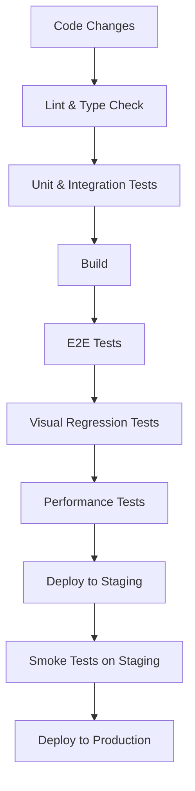

## Kế hoạch kiểm thử chi tiết

### 1. Chiến lược kiểm thử

#### Phân loại tests

- **Unit Tests**: Kiểm thử các components, functions, hooks riêng lẻ
- **Integration Tests**: Kiểm thử tương tác giữa các components
- **E2E Tests**: Kiểm thử luồng người dùng từ đầu đến cuối
- **Visual Regression Tests**: Kiểm thử UI không bị thay đổi ngoài ý muốn
- **Performance Tests**: Kiểm thử hiệu suất của ứng dụng

#### Code coverage targets

- Unit Tests: > 80%
- Integration Tests: > 70%
- E2E Tests: Các luồng chính (critical paths)

### 2. Công cụ kiểm thử

| Loại Test | Công cụ | Mục đích |
|-----------|---------|----------|
| Unit & Integration | Jest + React Testing Library | Kiểm thử components và logic |
| E2E | Cypress | Kiểm thử luồng người dùng |
| Visual Regression | Chromatic / Percy | Kiểm thử UI không bị thay đổi |
| Performance | Lighthouse CI | Kiểm thử hiệu suất |
| Accessibility | axe-core | Kiểm thử accessibility |

### 3. Quy trình kiểm thử

#### Quy trình CI/CD

#### Tự động hóa

- **Pre-commit hooks**: Lint, format, và type checking
- **CI pipeline**: Chạy tất cả tests khi có pull request
- **Nightly builds**: Chạy E2E tests và performance tests hàng đêm

### 4. Test cases ưu tiên

#### Authentication Flow

- Đăng nhập thành công
- Đăng nhập thất bại (sai credentials)
- Đăng ký tài khoản mới
- Quên mật khẩu
- Đăng xuất

#### Shopping Flow

- Tìm kiếm sản phẩm
- Lọc và sắp xếp sản phẩm
- Xem chi tiết sản phẩm
- Thêm sản phẩm vào giỏ hàng
- Cập nhật số lượng sản phẩm trong giỏ hàng
- Checkout và thanh toán

#### User Account Flow

- Xem thông tin tài khoản
- Cập nhật thông tin cá nhân
- Xem lịch sử đơn hàng
- Thêm/sửa/xóa địa chỉ

### 5. Kế hoạch kiểm thử song song

Trong giai đoạn chuyển đổi, chúng ta sẽ chạy tests song song trên cả hai phi��n bản:

1. **Kiểm thử so sánh**: Chạy cùng một test case trên cả User và Client
2. **Phân tích sự khác biệt**: Ghi lại và phân tích các khác biệt về behavior
3. **Đảm bảo tương đương**: Điều chỉnh Client để đảm bảo behavior giống với User

### 6. Báo cáo và theo dõi

- **Dashboard**: Tạo dashboard để theo dõi kết quả tests
- **Alerts**: Thiết lập cảnh báo khi tests fail
- **Trend Analysis**: Phân tích xu hướng để phát hiện regression