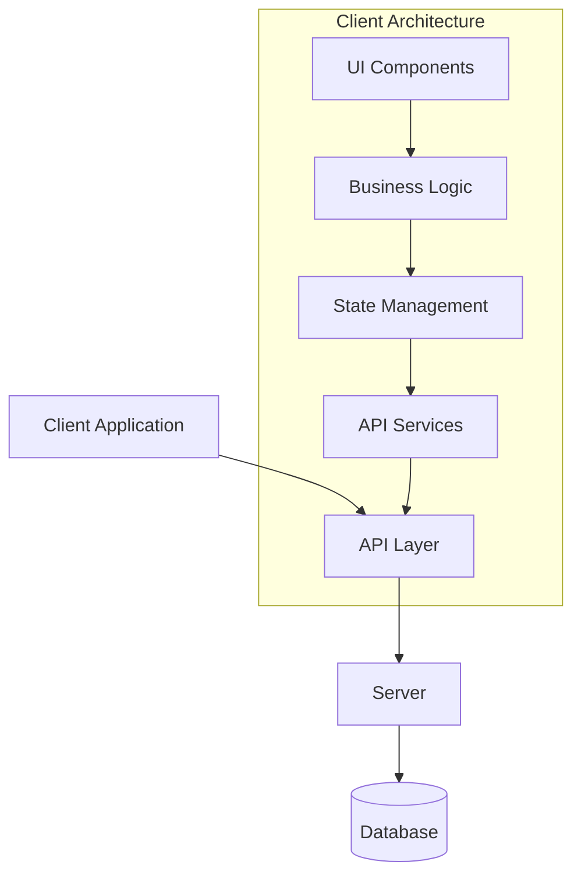
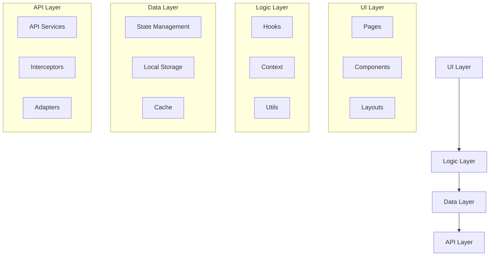
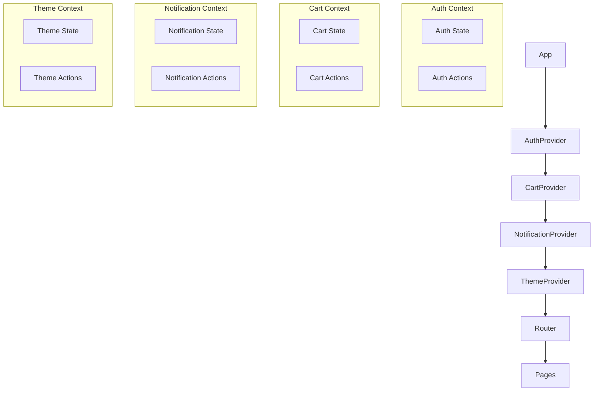
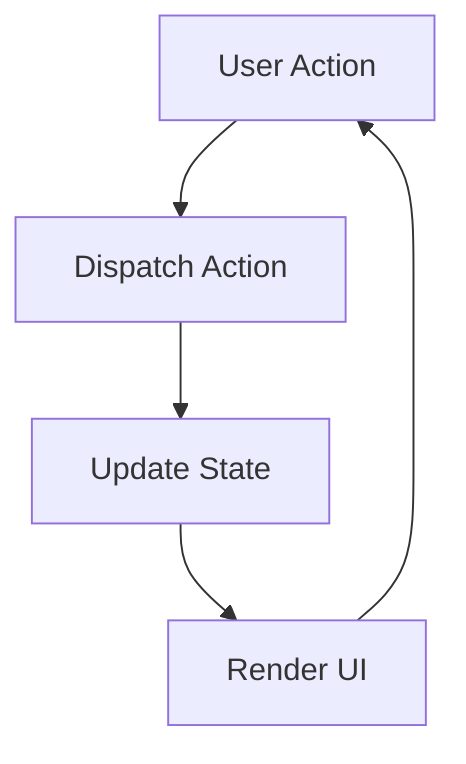
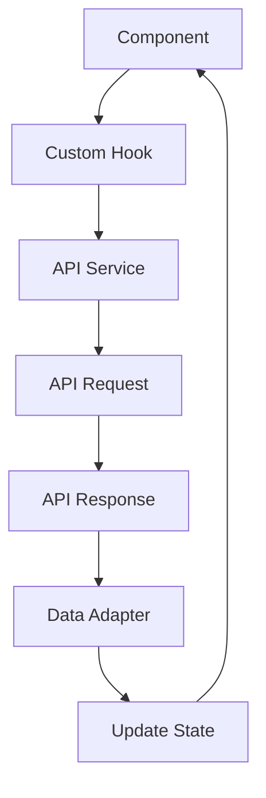

## Kiến trúc tổng thể

### 1. Tổng quan kiến trúc



### 2. Frontend Architecture

#### Kiến trúc theo layers



#### Component Architecture

Chúng ta sẽ sử dụng kiến trúc component-based với các nguyên tắc sau:

1. **Atomic Design**: Chia components thành atoms, molecules, organisms, templates và pages
2. **Component Composition**: Ưu tiên composition hơn inheritance
3. **Container/Presentational Pattern**: Tách logic và UI
4. **Custom Hooks**: Tách logic tái sử dụng vào custom hooks

```jsx
// Presentational Component
const ProductCard = ({ product, onAddToCart }) => (
  <div className="bg-white rounded-lg shadow p-4">
    
    <h3 className="text-lg font-medium mt-2">{product.name}</h3>
    <p className="text-gray-500">{product.description}</p>
    <div className="flex justify-between items-center mt-4">
      <span className="text-xl font-bold">${product.price}</span>
      <button 
        onClick={() => onAddToCart(product)} 
        className="bg-blue-600 text-white px-4 py-2 rounded"
      >
        Add to Cart
      </button>
    </div>
  </div>
);

// Container Component
const ProductCardContainer = ({ productId }) => {
  const { product } = useProduct(productId);
  const { addItem } = useCart();
  
  const handleAddToCart = (product) => {
    addItem(product);
  };
  
  if (!product) return <ProductCardSkeleton />;
  
  return <ProductCard product={product} onAddToCart={handleAddToCart} />;
};
```

### 3. State Management Architecture

#### Context Architecture



#### State Structure

```javascript
// Auth State
const authState = {
  user: null,
  isAuthenticated: false,
  loading: false,
  error: null,
};

// Cart State
const cartState = {
  items: [],
  totalItems: 0,
  totalPrice: 0,
  loading: false,
  error: null,
};

// Notification State
const notificationState = {
  notifications: [],
};

// Theme State
const themeState = {
  theme: 'light',
  isDarkMode: false,
};
```

### 4. API Architecture

#### API Layer Structure

```
services/
├── api-client.js         # Axios instance with interceptors
├── auth-service/
│   ├── AuthService.js    # Authentication API calls
│   └── index.js
├── user-service/
│   ├── UserService.js    # User-related API calls
│   └── index.js
├── product-service/
│   ├── ProductService.js # Product-related API calls
│   └── index.js
├── order-service/
│   ├── OrderService.js   # Order-related API calls
│   └── index.js
└── index.js              # Export all services
```

#### API Client Configuration

```javascript
// api-client.js
import axios from 'axios';
import { getToken, refreshToken } from '../auth/authUtils';

const apiClient = axios.create({
  baseURL: process.env.REACT_APP_API_URL,
  timeout: 10000,
  headers: {
    'Content-Type': 'application/json',
  },
});

// Request interceptor
apiClient.interceptors.request.use(
  (config) => {
    const token = getToken();
    if (token) {
      config.headers.Authorization = `Bearer ${token}`;
    }
    return config;
  },
  (error) => Promise.reject(error)
);

// Response interceptor
apiClient.interceptors.response.use(
  (response) => response.data,
  async (error) => {
    const originalRequest = error.config;
    
    // Handle token expiration
    if (error.response?.status === 401 && !originalRequest._retry) {
      originalRequest._retry = true;
      try {
        const newToken = await refreshToken();
        if (newToken) {
          originalRequest.headers.Authorization = `Bearer ${newToken}`;
          return apiClient(originalRequest);
        }
      } catch (refreshError) {
        // Redirect to login
      }
    }
    
    return Promise.reject(error);
  }
);

export default apiClient;
```

### 5. Routing Architecture

#### Route Structure

```javascript
// routes.js
import { lazy } from 'react';
import { Navigate } from 'react-router-dom';

// Layouts
import MainLayout from '../components/layout/MainLayout';
import AuthLayout from '../components/layout/AuthLayout';
import DashboardLayout from '../components/layout/DashboardLayout';

// Guards
import AuthGuard from '../components/guards/AuthGuard';
import GuestGuard from '../components/guards/GuestGuard';

// Lazy-loaded pages
const Home = lazy(() => import('../pages/Home'));
const Products = lazy(() => import('../pages/Products'));
const ProductDetail = lazy(() => import('../pages/ProductDetail'));
const Cart = lazy(() => import('../pages/Cart'));
const Checkout = lazy(() => import('../pages/Checkout'));
const Login = lazy(() => import('../pages/auth/Login'));
const Register = lazy(() => import('../pages/auth/Register'));
const Profile = lazy(() => import('../pages/account/Profile'));
const Orders = lazy(() => import('../pages/account/Orders'));
const NotFound = lazy(() => import('../pages/NotFound'));

const routes = [
  {
    path: '/',
    element: <MainLayout />,
    children: [
      { path: '/', element: <Home /> },
      { path: '/products', element: <Products /> },
      { path: '/products/:id', element: <ProductDetail /> },
      { path: '/cart', element: <Cart /> },
      {
        path: '/checkout',
        element: (
          <AuthGuard>
            <Checkout />
          </AuthGuard>
        ),
      },
      { path: '*', element: <NotFound /> },
    ],
  },
  {
    path: '/auth',
    element: <AuthLayout />,
    children: [
      { path: '/auth', element: <Navigate to="/auth/login" /> },
      {
        path: '/auth/login',
        element: (
          <GuestGuard>
            <Login />
          </GuestGuard>
        ),
      },
      {
        path: '/auth/register',
        element: (
          <GuestGuard>
            <Register />
          </GuestGuard>
        ),
      },
    ],
  },
  {
    path: '/account',
    element: (
      <AuthGuard>
        <DashboardLayout />
      </AuthGuard>
    ),
    children: [
      { path: '/account', element: <Navigate to="/account/profile" /> },
      { path: '/account/profile', element: <Profile /> },
      { path: '/account/orders', element: <Orders /> },
    ],
  },
];

export default routes;
```

### 6. Data Flow Architecture

#### Unidirectional Data Flow



#### API Data Flow



### 7. Folder Structure

```
client/
├── public/                 # Static files
├── src/
│   ├── assets/             # Images, fonts, etc.
│   ├── components/         # Reusable components
│   │   ├── common/         # Basic components
│   │   ├── layout/         # Layout components
│   │   └── features/       # Feature-specific components
│   ├── config/             # App configuration
│   ├── context/            # React Context providers
│   ├── hooks/              # Custom React hooks
│   ├── pages/              # Page components
│   ├── services/           # API services
│   ├── styles/             # Global styles
│   ├── utils/              # Utility functions
│   ├── App.jsx             # Root component
│   └── index.jsx           # Entry point
├── .env                    # Environment variables
├── .eslintrc.js            # ESLint configuration
├── .prettierrc             # Prettier configuration
├── package.json            # Dependencies
└── README.md               # Documentation
```

### 8. Dependency Architecture

#### Core Dependencies

- **React**: UI library
- **React Router**: Routing
- **Axios**: HTTP client
- **Tailwind CSS**: Styling
- **Jest & React Testing Library**: Testing

#### Development Dependencies

- **ESLint**: Code linting
- **Prettier**: Code formatting
- **Husky**: Git hooks
- **lint-staged**: Run linters on staged files

#### Optional Dependencies

- **React Query**: Data fetching and caching
- **Formik/React Hook Form**: Form management
- **Yup/Zod**: Schema validation
- **date-fns**: Date manipulation
- **react-i18next**: Internationalization