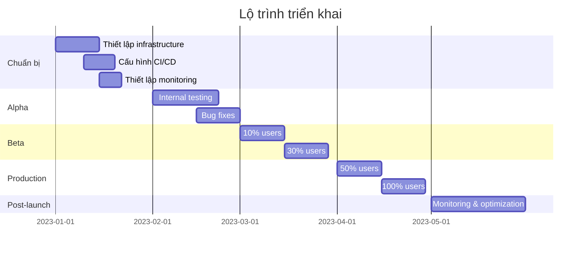

## Kế hoạch triển khai và monitoring

### 1. Chiến lược triển khai

#### Phương pháp triển khai

Chúng ta sẽ sử dụng phương pháp **Blue-Green Deployment** kết hợp với **Feature Flags**:

1. **Blue-Green Deployment**:
   - **Blue**: Phiên bản hiện tại (User)
   - **Green**: Phiên bản mới (Client)
   - Chuyển đổi traffic dần dần từ Blue sang Green

2. **Feature Flags**:
   - Triển khai các tính năng mới dưới dạng feature flags
   - Bật/tắt tính năng cho từng nhóm người dùng
   - Rollback nhanh chóng nếu phát hiện vấn đề

#### Lộ trình triển khai



### 2. Infrastructure

#### Hosting & Deployment

- **Hosting**: AWS (Amazon Web Services)
- **CDN**: CloudFront
- **CI/CD**: GitHub Actions
- **Container**: Docker
- **Orchestration**: Kubernetes

#### Cấu hình

```yaml
# docker-compose.yml example
version: '3'
services:
  client:
    build: ./client
    ports:
      - "3000:3000"
    environment:
      - NODE_ENV=production
      - API_URL=https://api.example.com
    volumes:
      - ./client:/app
    depends_on:
      - api
  
  api:
    build: ./server
    ports:
      - "8000:8000"
    environment:
      - NODE_ENV=production
      - DB_CONNECTION=...
    volumes:
      - ./server:/app
```

### 3. Monitoring & Alerting

#### Metrics to monitor

| Metric | Tool | Threshold | Alert |
|--------|------|-----------|-------|
| Page Load Time | New Relic | > 3s | Slack + Email |
| Error Rate | Sentry | > 1% | Slack + PagerDuty |
| API Response Time | Datadog | > 500ms | Slack |
| CPU Usage | CloudWatch | > 80% | Email |
| Memory Usage | CloudWatch | > 80% | Email |
| User Engagement | Google Analytics | -20% | Email |

#### Dashboard

Tạo dashboard tập trung hiển thị:
- Hiệu suất ứng dụng
- Lỗi và exceptions
- User engagement
- Conversion rates
- Feature flag adoption

### 4. Rollback Plan

#### Trigger points

Kích hoạt rollback nếu:
- Error rate tăng > 5%
- Page load time tăng > 100%
- Conversion rate giảm > 10%
- Critical bug ảnh hưởng đến business logic

#### Quy trình rollback

1. **Immediate Rollback**: Chuyển 100% traffic về phiên bản cũ
2. **Phân tích nguyên nhân**: Debug và xác định nguyên nhân
3. **Fix và Test**: Sửa lỗi và test kỹ lưỡng
4. **Re-deploy**: Triển khai lại với fix đã được kiểm chứng

### 5. Kế hoạch đào tạo và hỗ trợ

#### Đào tạo nội bộ

- Workshop về codebase mới
- Documentation chi tiết
- Pair programming sessions

#### Hỗ trợ người dùng

- In-app tutorials cho UI mới
- Help center với FAQs
- Live chat support trong giai đoạn chuyển đổi
- Feedback mechanism để thu thập ý kiến người dùng